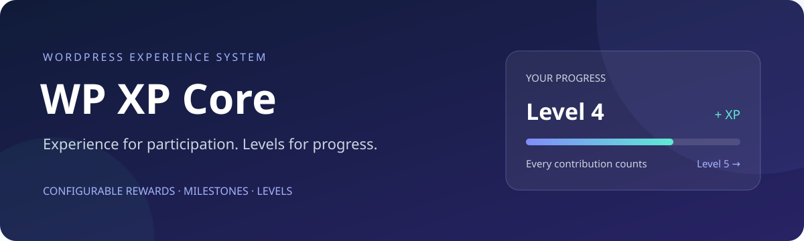

  
  
  
  
  

<strong>为站点参与积累经验，用可配置的等级呈现成长。</strong>

简体中文 · <a href="README.en.md">English</a>

<a href="#开始使用">开始使用</a> · <a href="docs/GUIDE.md">使用指南</a> · <a href="docs/CONFIGURATION.md">服务器配置</a> · <a href="CHANGELOG.md">更新记录</a>

## 你能用它做什么

- **奖励日常参与。** 每日签到、有效阅读、发表文章与合格评论都可获得经验，各活动奖励由管理员设置。
- **鼓励作者创作。** 为文章配置三档浏览里程碑；接入 PageNest Companion 后，还可配置三档点赞里程碑。
- **设计自己的成长曲线。** 用可增删列表设置 1–100 级的最低经验，无需改代码。
- **让用户看见进度。** 经验面板展示当前经验、等级、距离下一级的经验、签到按钮与近期私人记录。
- **保留奖励依据。** 以事件账本记录经验变化，重复请求不会重复领取同一奖励。

经验与等级由插件独立维护，无需 myCRED。点赞服务是可选集成；不可用时，后台会禁用点赞规则，其余设置仍可编辑。

## 开始使用

**当前源码版本为 1.4.1。** 新站上传安装包并启用后，插件会建立经验账本并使用默认规则，无需配置服务器 JSON，也无需安装其他经验插件。既有用户从 0 经验开始，不会根据旧文章或历史评论自动补发奖励。

1. 从 [Release](https://github.com/wzf2000/wp-xp-core/releases) 下载 `wp-xp-core-版本号.zip`，不要使用 GitHub 自动生成的 **Source code** 压缩包。首次安装自动配置需要 **1.4.0 或更高版本**；旧版安装要求以其发行文档为准。
2. 在 WordPress **插件 → 安装插件 → 上传插件** 中安装 ZIP 并启用。
3. 打开 **设置 → WP XP Core**，查看或修改奖励与等级规则；默认值可直接使用。
4. 新建一个名为 “我的经验” 的普通页面，添加 **短代码** 区块，填入 `[reader_experience]`，然后发布。详细步骤见[创建经验页面](docs/GUIDE.md#创建经验页面)。
5. 回到插件设置，在 **添加经验面板** 中选择刚发布的页面，点击 **保存面板页面**。用户登录后便可在该页查看经验、签到和最近记录。

“我的经验” 是普通 WordPress 页面，不要求站点已有账户系统。经验内容按当前登录用户展示；插件启用时不会自动创建或发布页面。

已安装的站点可用新 Release ZIP 更新。停用／重新启用会保留经验与设置；自动更新器尚未提供。服务器外部配置属于可选的[高级接入](docs/CONFIGURATION.md)，普通首次安装无需阅读或准备旧插件迁移。

## 配置你的经验规则

设置页将规则分为 **日常活动、作者里程碑、等级成长**。可以单独设置奖励、阅读／评论每日次数、里程碑触发次数与每级门槛。

| 活动                   | 默认规则                                                  |
| ---------------------- | --------------------------------------------------------- |
| 每日签到               | +2，每日一次                                              |
| 有效阅读               | 停留至少 15 秒，+1，每日最多奖励 3 次                     |
| 首次发表文章           | 每篇 +20                                                  |
| 合格评论               | 每条 +2，每日最多奖励 3 次                                |
| 作者浏览里程碑         | 100／500／1000 次，分别 +5／10／20                        |
| 作者点赞里程碑（可选） | 10／30／100 次，分别 +5／10／20                           |
| 等级成长               | 默认 10 级：0、5、20、60、150、300、600、1000、1800、3000 |

**奖励变更用于之后首次记账的事件；等级门槛变更会即时影响等级展示。** 修改门槛不会改动余额，保存设置也不会补发奖励。每篇文章每档里程碑只领取一次；降低次数后，尚未领取的档位可能在下一次有效活动时达标。

取值范围、评论资格、计数方式及示例见[规则设置指南](docs/GUIDE.md#设置经验规则)。

## 文档与帮助

| 你想做什么                         | 阅读入口                            |
| ---------------------------------- | ----------------------------------- |
| 设置奖励、添加等级、放置经验面板   | [使用指南](docs/GUIDE.md)           |
| 排查维护提示、未获得经验、点赞禁用 | [常见问题](docs/GUIDE.md#常见问题)  |
| 接入服务器配置、存储或其他插件     | [配置与集成](docs/CONFIGURATION.md) |
| 查看版本变化                       | [更新记录](CHANGELOG.md)            |
| 参与开发或提交改进                 | [贡献指南](CONTRIBUTING.md)         |
| 维护 GitHub 发行                   | [发布流程](docs/RELEASING.md)       |

`main` 中的文档反映当前源码。使用已发布版本时，请以对应 Release 标签内的文档为准。

遇到问题可[提交 Issue](https://github.com/wzf2000/wp-xp-core/issues/new/choose)，附上版本、现象与复现步骤。安全问题请按[安全政策](SECURITY.md)私下报告。

## 作者与许可

由 [wzf2000](https://github.com/wzf2000) 维护，采用 **[GPL-2.0-or-later](LICENSE)**。欢迎通过 Issue 和 Pull Request 参与改进。
